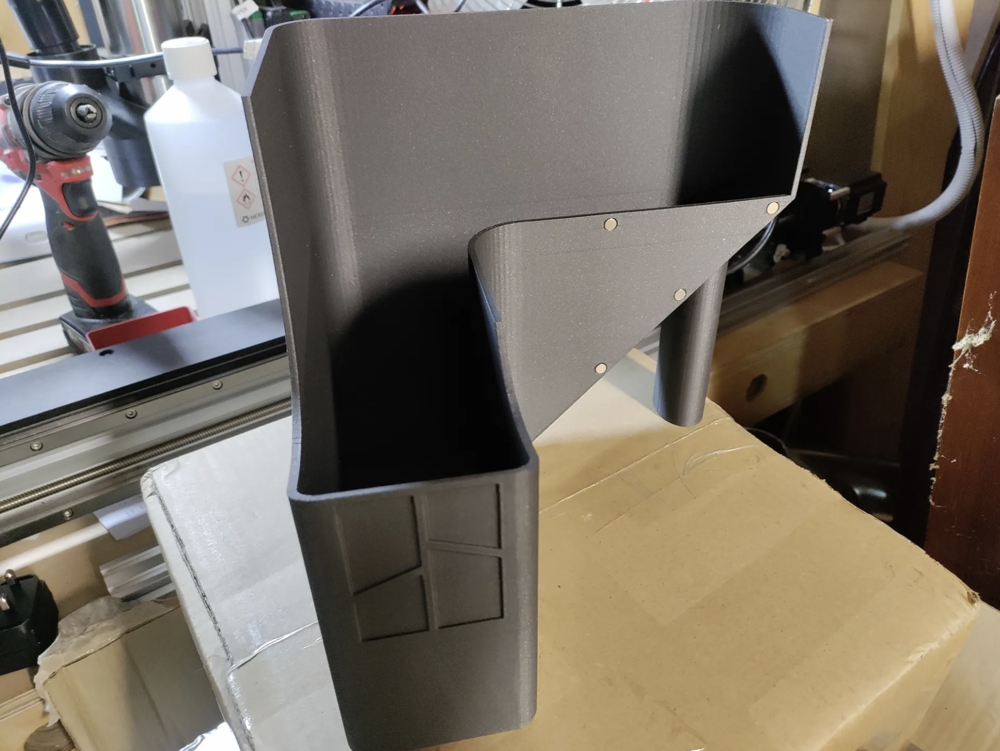
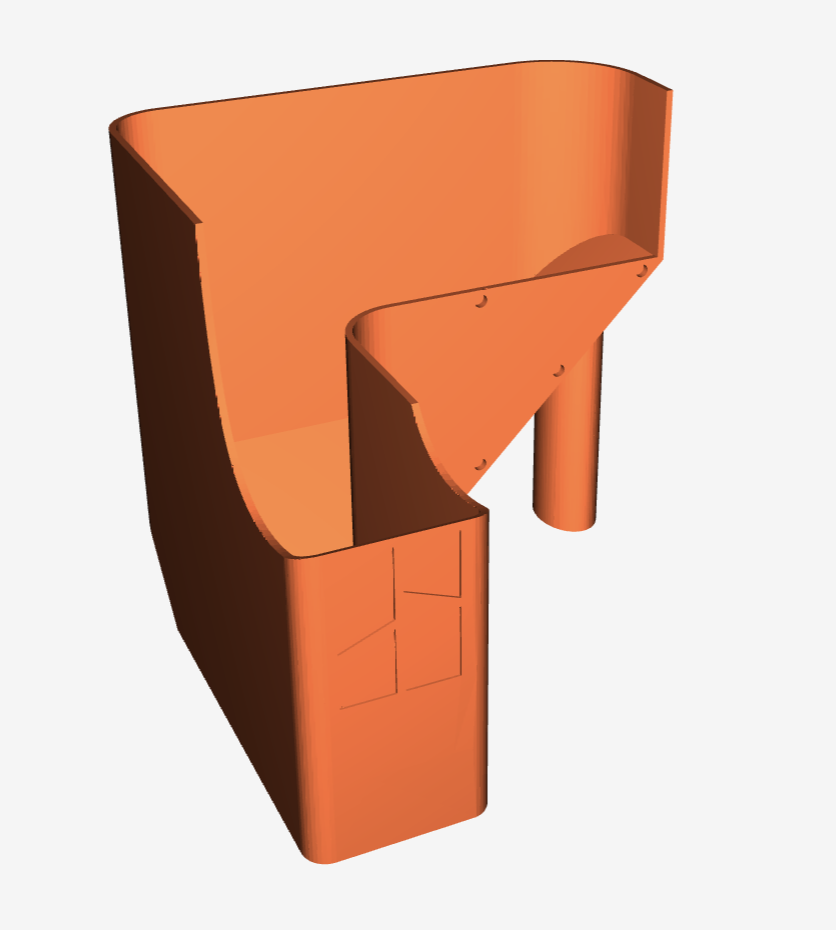
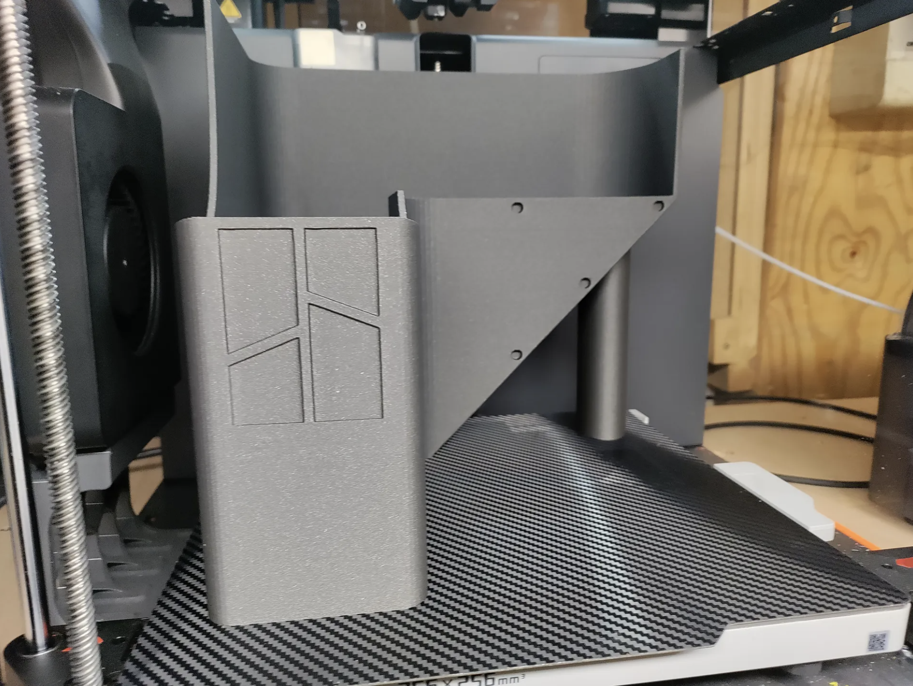
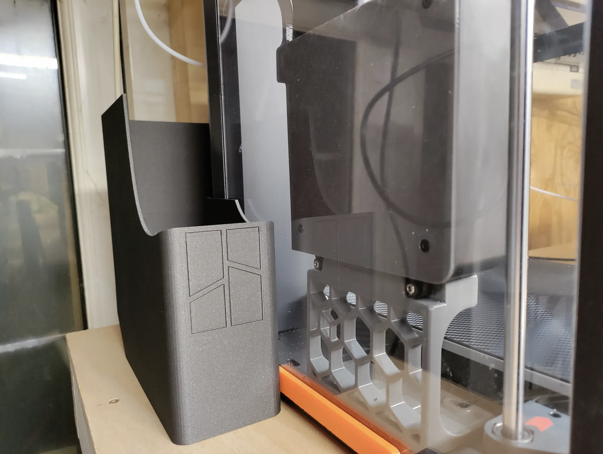
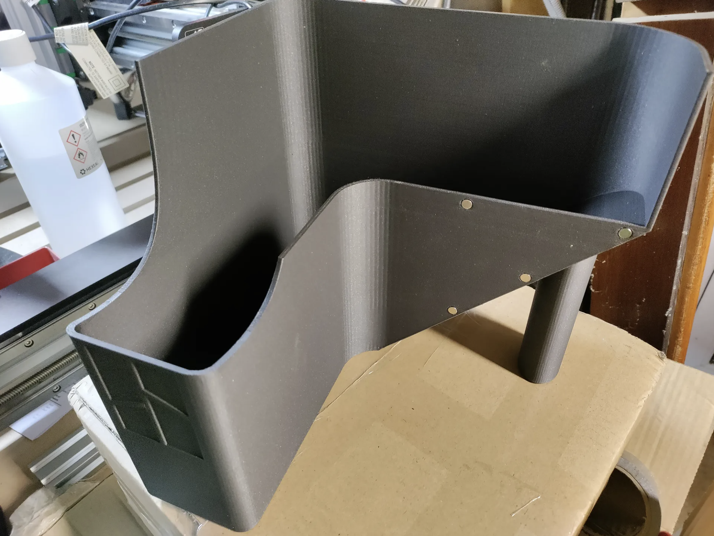
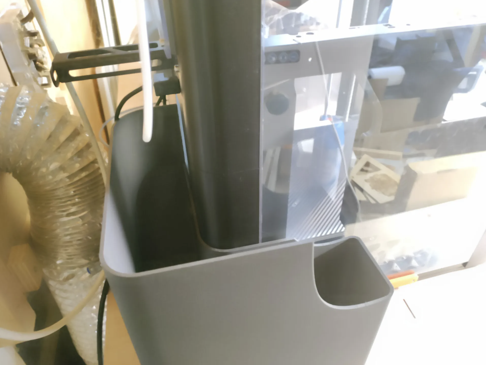
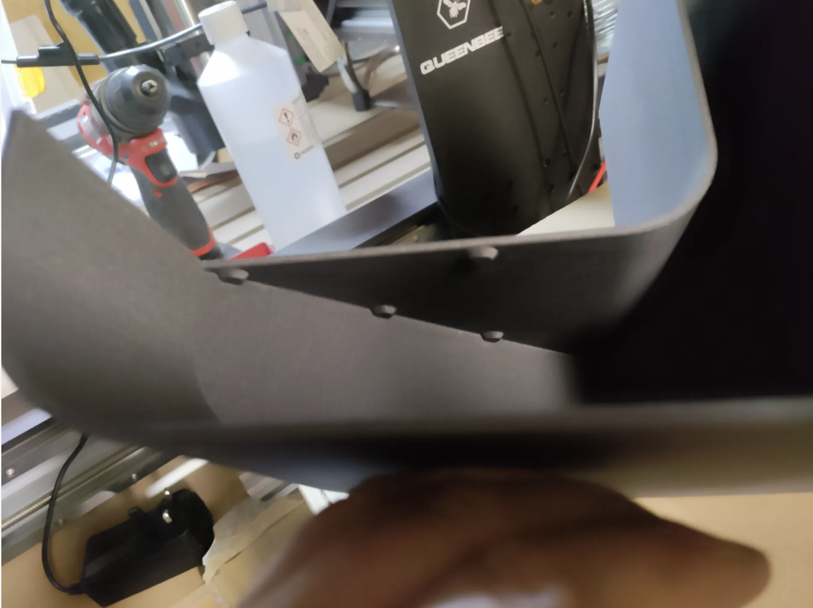

# Bambu Poop Chute Magnet Remix
[![CC BY-NC-SA 4.0][cc-by-nc-sa-image]][cc-by-nc-sa]

A magnet remix of the [Bambu Poop Chute](https://www.printables.com/model/461345-bambu-poop-chute) by [Fantasy3DPrintsShop](https://www.printables.com/@KevinV_460266)

This is a remix of the great design of Bambu Poop Chute by Fantasy3DPrintsShop

Uses 6x3mm magnets to attach the chute to the back of the X1C, P1P or P1S case.

No supports are required.

Used 380g of filament and I was able to use ludacris mode after the base layers were printed to decrease the print time.

6x3mm magnets are easily sourced from amazon, ebay or aliexpress.  I used N45 grade which gives nice attachment strength.

The magnets are a tight fit when pushing in.  If it feels too tight, use a craft knife to gently scrape, sand or cut away the top of the hole to enlarge slightly.  If you make too large - no problem just use a bit of super glue to hold the magnets in.

## Print Options
- 0.4mm nozzle
- 2 layer wall
- no support
- 10% infill
- no brim
- no supports
- top surface only ironing
- adaptive layer height (using the default adaptive layer bambu studio settings)

## 3D Model

## More Pictures

This work is licensed under a
[Creative Commons Attribution-NonCommercial-ShareAlike 4.0 International License][cc-by-nc-sa].

[![CC BY-NC-SA 4.0][cc-by-nc-sa-image]][cc-by-nc-sa]

[cc-by-nc-sa]: http://creativecommons.org/licenses/by-nc-sa/4.0/
[cc-by-nc-sa-image]: https://licensebuttons.net/l/by-nc-sa/4.0/88x31.png
[cc-by-nc-sa-shield]: https://img.shields.io/badge/License-CC%20BY--NC--SA%204.0-lightgrey.svg
